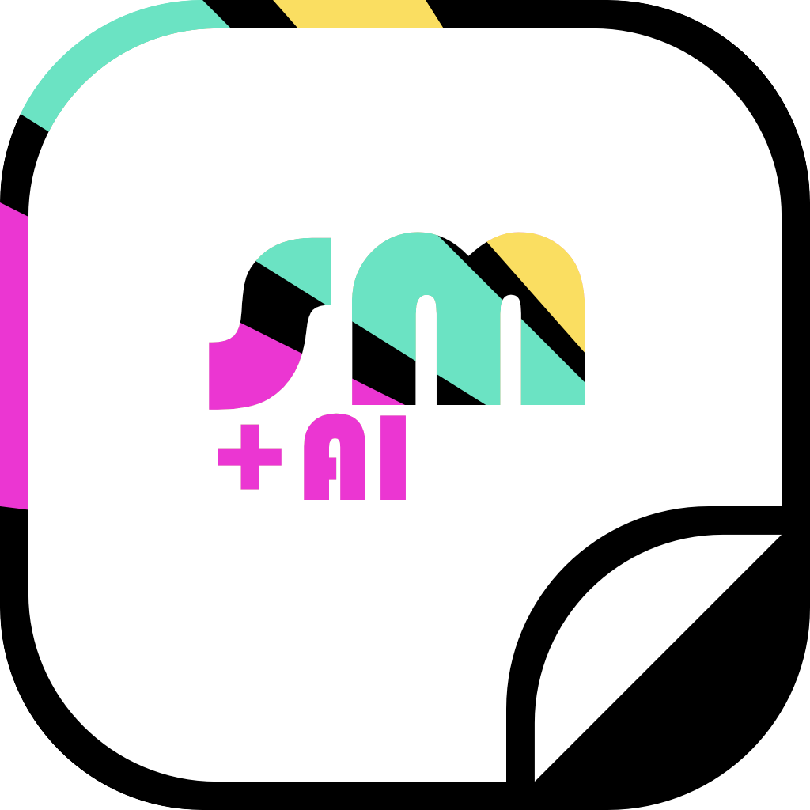

# Sticker Maker

Aus einem Bild wird ein druckreifer Sticker als transparentes PNG — Freistellen, Rand,
Gebrauchsspuren, Holo-Finish und Text. **Läuft vollständig im Browser.** Eine einzige
HTML-Datei, kein Konto, kein Upload, kein Server: die Bilder verlassen das Gerät nicht.

---

## Was diesen Maker besonders macht

**Vier Wege zur Form — die Erkennung ist optional.** Die meisten Werkzeuge zwingen jedes Bild
durch eine Motiverkennung. Hier ist sie einer von vier gleichberechtigten Wegen: vollflächig
zuschneiden, Pfad von Hand klicken, Motiv erkennen lassen, oder ein fertig freigestelltes PNG
unverändert übernehmen. Wer die Vorarbeit schon geleistet hat, braucht nur noch Rand und Effekte.

**Der transparente Rand sieht aus wie transparente Folie.** „Transparent" heißt hier nicht
„unsichtbar": *Milchig* gibt der Klarfläche den leichten Schleier echter Folie, die
*Schmutzkante* setzt ungleichmäßigen Abrieb genau auf den äußersten Saum — dorthin, wo sich bei
einem benutzten Sticker der Dreck sammelt.

**Die Gebrauchsspuren folgen der Randwahl.** Weißer Rand → weiße Kratzer. Transparenter Rand →
echte Löcher durch die Folie. Kein aufgemalter Filter, sondern dieselbe physikalische Logik wie
beim echten Aufkleber.

**Ein Regenbogenfeld für alles.** Der Pastellverlauf und die Farbe jedes einzelnen Splitters
bzw. Glitterkorns stammen aus **demselben** Farbfeld — Nachbarn teilen den Farbton, ein Sweep
läuft sichtbar über den Sticker. Zwei unabhängige Zufallseffekte nebeneinander sehen falsch aus;
das hier nicht.

**Glanz liegt nicht auf Kratzstellen.** Eine Kratzstelle ist abgetragene Folie — dort ist der
Glanz weg. Und beim Glitter tragen Regenbogen und farbige Körnung nur den Druck, während der
weiße Die-Cut-Rand dieselbe Körnung klar und entsättigt trägt: Klarglitter über der Folie.

**Text, der mitaltert.** Die Schrift liegt standardmäßig **unter** Gebrauchsspuren und Glitter,
wird also mit dem Sticker abgenutzt — sie ist Teil des Drucks, kein Overlay. Für Schlagzeilen
gibt es den Umschalter „Obendrauf".

**Zehn Schriften eingebettet.** Keine Google-Fonts-Abfrage, kein Netz nötig, alle unter SIL Open
Font License oder Apache 2.0 — mit den Ergebnissen darf verkauft werden.

**Zoom, der die Werkzeuge nicht bricht.** Bei jeder Zoomstufe treffen Pinsel, Pfadpunkte und
Zuschnittrahmen exakt dort, wo geklickt wird.

**Zweisprachig und mit Dunkelmodus.** Deutsch/Englisch auf Knopfdruck, helles und dunkles
Erscheinungsbild.

---

## Sofort ausprobieren

**Lokal.** [`Sticker Maker.html`](Sticker%20Maker.html) herunterladen und doppelklicken.
Das war's — alles außer der KI-Erkennung funktioniert ohne Internet.

**Online.** Dieselbe Datei auf beliebigen Webspace legen, oder im Repository unter
*Settings → Pages* GitHub Pages aktivieren — `index.html` ist dieselbe App und wird dann direkt
ausgeliefert. Danach von jedem Gerät per Link erreichbar.

**Als App.** Im Browser geöffnet: Chrome/Edge → „Diese Seite als App installieren".
Auf dem Telefon: Teilen → „Zum Home-Bildschirm". Eigenes Symbol, eigenes Fenster, kein
Store-Konto. (Fürs iPhone muss die Seite über eine `https`-Adresse laufen.)

---

## Schritt für Schritt

### 1 · Bild laden

Ins Vorschaufenster ziehen, anklicken zum Auswählen, oder mit `Cmd/Strg + V` aus der
Zwischenablage einfügen.

### 2 · Form festlegen — vier Wege

Der Weg wird **vor** dem Laden gewählt, damit kein Bild ungewollt durch die Erkennung läuft.

| Weg | wofür | wie |
| --- | --- | --- |
| **Vollflächig** | Fotos, Memes, alles Rechteckige | Format wählen (frei · 1:1 · 4:5 · 3:4 · 16:9 · 9:16), Rahmen ziehen, *Zuschnitt übernehmen* → **Eckig** oder **Gerundet** mit Radius bis 100 % (= Pille bzw. Kreis) |
| **Pfad** | schwierige Motive, volle Kontrolle | Punkte klicken, gerade Linien dazwischen, Form schließt selbst. Punkt ziehen justiert, Klick auf eine Linie setzt einen Punkt ein, *Auswahl übernehmen* |
| **Motiv erkennen** | Personen, Produkte, Tiere | Freistellung durch ein KI-Modell im Browser, danach Kantenweichheit und Kanteneinzug feinjustieren |
| **Freigestellt** | fertige PNGs mit Transparenz | der Alphakanal der Datei wird unverändert übernommen — keine Erkennung, kein Zuschnitt |

Bei „Motiv erkennen" und „Freigestellt" gibt es zusätzlich den **Korrekturpinsel**: direkt im
Vorschaubild radieren oder zurückholen.

### 3 · Rand

An/aus, dann **Weiß** (klassischer Sticker-Rand) oder **Transparent** (Klarfolie).
Randbreite 0–70 px, *Kontur glätten* 0–100 % für einen Die-Cut-Umriss statt der exakten
Motivkontur. Bei transparentem Rand kommen **Milchig** und **Schmutzkante** dazu.

### 4 · Used Look

Kratzer, Abrieb oder Knicke — prozedural erzeugt, oder eine eigene Maske als Bild hochladen
(mit Umschalter, ob Weiß oder Schwarz die Kratzstelle ist). Stärke, Maskengröße 0,2–3×,
Drehung, horizontal spiegeln, zentrieren, **neu würfeln** — und Ziehen im Vorschaubild
verschiebt die Maske.

### 5 · Holo-Effekt

**Regenbogen** legt einen breiten Pastellverlauf über die Fläche. Darauf wahlweise:

- **Splitter** — kantige Broken-Glass-Fragmente, jedes in einer flachen Farbe
- **Glitter** — feine Körnung mit Eigenvariation, einzelne Körner blitzen fast weiß auf

Dazu Größe, **Dichte bis 500 %** und *Zufällige Reflexion*, die das ganze Farbfeld neu würfelt.

### 6 · Text

Zehn Schriften als Raster, jede in ihrem eigenen Schnitt gesetzt — oder eine eigene
Schriftdatei laden. Farbe als **Weiß · Schwarz · Farbe · Stanzen**; „Farbe" öffnet Farbton,
Sättigung und Helligkeit, „Stanzen" schneidet den Text durch den Sticker hindurch.
Die Kontur wählt ihre Farbe selbst: Schwarz hinter weißer Schrift, Weiß hinter schwarzer, und
bei einer Farbe derselbe Ton eine Spur lauter — nie die stumpfe Gegenfarbe.
Größe, Drehung, Laufweite, Deckkraft; Ziehen positioniert. Umschalter **Mit altern / Obendrauf**.

### 7 · Export

PNG mit Transparenz in **1× · 2× · Originalauflösung**.

---

## Werkzeuge rund um die Bühne

| | |
| --- | --- |
| **Zoom** | −/Wert/+ · Klick auf den Wert passt ein · `Strg/Cmd` + Scrollen zoomt auf den Zeiger · mittlere Maustaste verschiebt |
| **Vorschau-Hintergrund** | Schachbrett · Dunkel · Hell · eigenes Foto (zeigt den Sticker auf Laptop, Flasche, Notizbuch) |
| **Sprache** | Deutsch / Englisch |
| **Erscheinungsbild** | Hell / Dunkel |

---

## Ohne Internet

Alles außer der KI-Erkennung: Zuschnitt, Formwahl, Pfad, PNG-Alpha, Pinsel, Rand, Used Look,
Holo, Glitter, Text und Export. Die Schriften sind in der Datei eingebettet.

Die **KI-Erkennung** lädt ihr Modell beim ersten Mal einmalig aus dem Netz (~45 MB, danach aus
dem Browser-Cache). Ist kein Netz da, springt automatisch eine Offline-Freistellung ein, die
sich mit dem Pinsel nachbessern lässt.

---

## Lizenzen

**Der Code** steht unter Custom License Nutzungsrechte. Diese unter `LICENSE` beachten.

**Die zehn Schriften** stehen unter SIL Open Font License oder Apache 2.0: mit den Ergebnissen
darf verkauft werden, nur die Schriftdatei selbst nicht weiterverkauft.

**Das Erkennungsmodell** ([RMBG 1.4](https://huggingface.co/briaai/RMBG-1.4) von BRIA AI) ist
**nur für nicht-kommerzielle Nutzung** frei; für kommerzielle Nutzung braucht es eine
Vereinbarung mit BRIA. Das betrifft ausschließlich den Weg „Motiv erkennen" — vollflächig, Pfad
und Freigestellt nutzen kein Modell und sind davon unberührt. Dies ist keine Rechtsberatung.

---

# English Translation

# Sticker Maker

Turn an image into a print-ready sticker as a transparent PNG — background removal, border, wear & tear, holo finish, and text. **Runs entirely in your browser.** A single HTML file, no account, no upload, no server: images never leave your device.

---

## What makes this maker special

**Four ways to shape — subject detection is optional.** Most tools force every image through subject recognition. Here, it is just one of four equal paths: crop full-area, click a path by hand, detect subject automatically, or import a pre-cut PNG as-is. If you've already done the prep work, all you need are the border and effects.

**The transparent border looks like real clear foil.** "Transparent" here doesn't mean "invisible": *Milky* gives the clear area the slight haze of real foil, while *Dirty edge* adds uneven wear precisely to the outermost seam — right where dirt collects on a used sticker.

**Wear and tear follows your border choice.** White border → white scratches. Transparent border → real holes through the foil. Not a painted-on filter, but the same physical logic as an actual sticker.

**A single rainbow field for everything.** The pastel gradient and the color of every single shard or grain of glitter come from the **same** color field — neighbors share hue, and a sweep visibly runs across the sticker. Two independent random effects side-by-side look wrong; this doesn't.

**Gloss doesn't sit on scratches.** A scratch is worn-away foil — the gloss is gone there. And for glitter, the rainbow and colored grains only carry the print, while the white die-cut border carries the same grain pattern clearly and desaturated: clear glitter over the foil.

**Text that ages with the sticker.** By default, text sits **underneath** wear & tear and glitter, so it wears down alongside the sticker — it's part of the print, not an overlay. For headlines, there's an "On top" toggle.

**Ten embedded fonts.** No Google Fonts calls, no network required, all licensed under SIL Open Font License or Apache 2.0 — products made with them can be sold.

**Zoom that doesn't break the tools.** At any zoom level, brushes, path points, and crop frames land exactly where you click.

**Bilingual with dark mode.** German/English at the click of a button, light and dark appearance.

---

## Try it right now

**Locally.** Download [`Sticker Maker.html`](Sticker%20Maker.html) and double-click it. That's it — everything except AI subject detection works offline.

**Online.** Place the same file on any web host, or enable GitHub Pages under *Settings → Pages* in the repository — `index.html` is the same app and will be served directly. Accessible via link from any device.

**As an App.** Opened in browser: Chrome/Edge → "Install this page as an app". On mobile: Share → "Add to Home Screen". Custom icon, dedicated window, no app store account. (For iPhones, the page must be served over an `https` address.)

---

## Step by step

### 1 · Load image

Drag into the preview window, click to select, or paste from clipboard using `Cmd/Ctrl + V`.

### 2 · Set shape — four ways

The method is selected **before** loading so no image is accidentally processed by subject recognition.

| Path | Purpose | How |
| --- | --- | --- |
| **Full-area** | Photos, memes, anything rectangular | Select format (Free · 1:1 · 4:5 · 3:4 · 16:9 · 9:16), drag frame, *Apply crop* → **Square** or **Rounded** with radius up to 100% (= pill or circle) |
| **Path** | Complex subjects, total control | Click points, straight lines in between, shape closes automatically. Dragging a point adjusts it, clicking a line inserts a point, *Apply selection* |
| **Detect subject** | People, products, animals | Background removal via a browser AI model, then fine-tune edge softness and edge offset |
| **Pre-cut** | Ready-made PNGs with transparency | File alpha channel is adopted as-is — no recognition, no cropping |

For "Detect subject" and "Pre-cut", a **Correction brush** is also available: erase or restore directly on the preview image.

### 3 · Border

On/off, then **White** (classic sticker border) or **Transparent** (clear foil). Border width 0–70 px, *Smooth outline* 0–100% for a die-cut silhouette instead of the exact subject outline. For transparent borders, **Milky** and **Dirty edge** options become available.

### 4 · Used look

Scratches, wear, or creases — procedurally generated, or upload a custom image mask (with a toggle to swap whether white or black represents scratches). Intensity, mask scale 0.2–3×, rotation, flip horizontally, center, **re-roll** — and dragging on the preview image repositions the mask.

### 5 · Holo effect

**Rainbow** overlays a broad pastel gradient across the surface. Optionally add:

- **Shards** — angular broken-glass fragments, each in a flat color
- **Glitter** — fine grain with individual variations, single grains flashing nearly white

Plus size, **density up to 500%**, and *Random reflection*, which re-rolls the entire color field.

### 6 · Text

Ten fonts as a grid, each rendered in its own weight/style — or load a custom font file. Color as **White · Black · Color · Punch-out**; "Color" unlocks hue, saturation, and lightness, "Punch-out" cuts the text through the sticker. The outline selects its own color automatically: black behind white text, white behind black, and for custom colors, the same hue slightly louder — never a dull complementary color. Size, rotation, letter spacing, opacity; drag to position. **Age with sticker / On top** toggle.

### 7 · Export

PNG with transparency in **1× · 2× · Original resolution**.

---

## Canvas tools

| | |
| --- | --- |
| **Zoom** | −/Value/+ · Clicking the value fits to screen · `Ctrl/Cmd` + Scroll zooms to pointer · Middle mouse button pans |
| **Preview background** | Checkerboard · Dark · Light · Custom photo (shows sticker on laptop, bottle, notebook) |
| **Language** | German / English |
| **Appearance** | Light / Dark |

---

## Offline use

Everything except AI subject detection works offline: cropping, shape selection, path tool, PNG alpha, brush, border, used look, holo, glitter, text, and export. Fonts are embedded in the file.

The **AI detection** downloads its model once on first use (~45 MB, cached in browser thereafter). If offline, a fallback offline cutout triggers automatically, which can be touched up with the brush tool.

---

## Licenses

**The code** is covered under Custom License usage rights. Please review `LICENSE`.

**The ten fonts** are licensed under SIL Open Font License or Apache 2.0: products created with them may be sold; only reselling the font files themselves is prohibited.

**The recognition model** ([RMBG 1.4](https://huggingface.co/briaai/RMBG-1.4) by BRIA AI) is **free for non-commercial use only**; commercial use requires an agreement with BRIA. This exclusively affects the "Detect subject" path — full-area, path, and pre-cut do not use a model and are unaffected. This is not legal advice.
